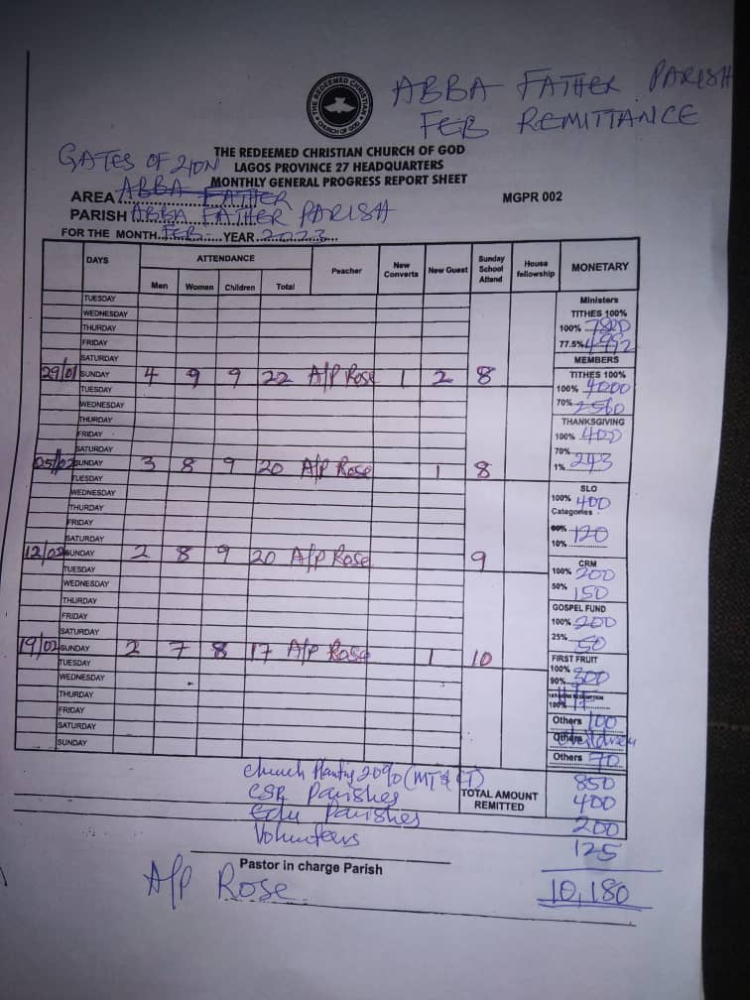
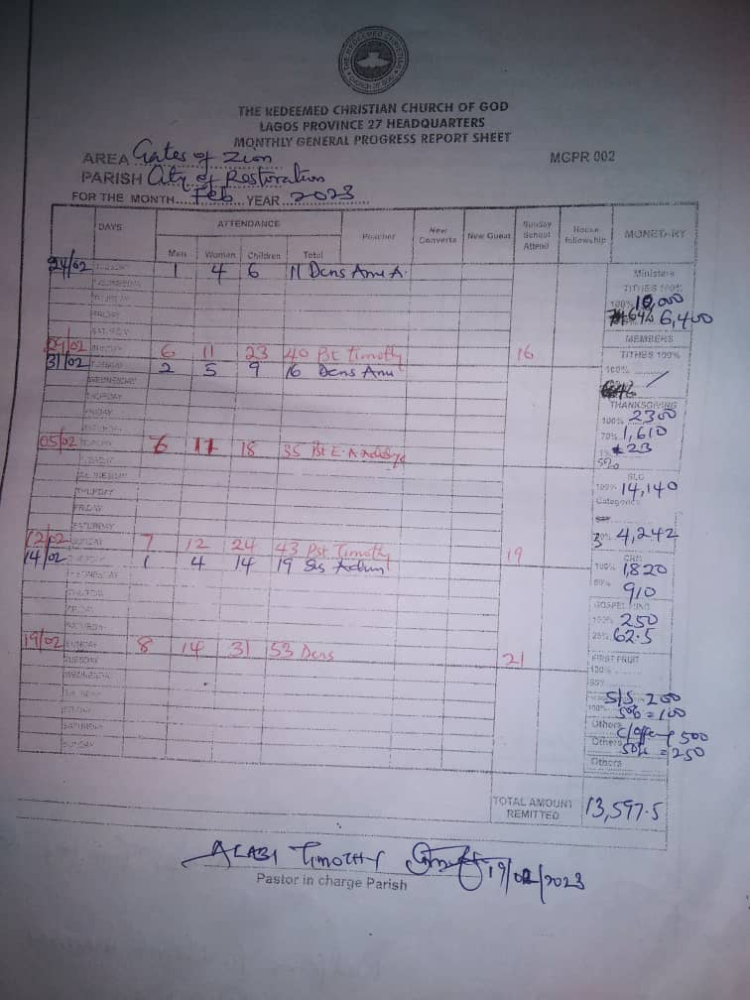
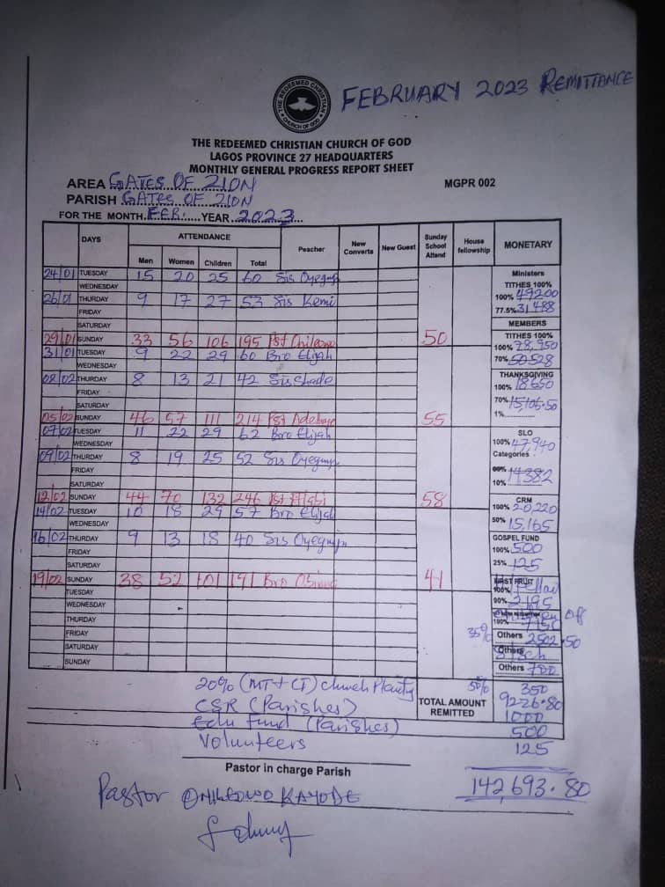

# Confirm Stores Analysis

 
---

## Introduction
copy from a document somwhere **Confirm Stores**
to italize **_fine_**
put disclaimer in your work here **_disclaimer_**

## Problem statement

## Skills/ concepts demonstrated:

The following 
- Quick measures
- Page navigation
- Modelling
- Filters

## Modelling

Adjusted        |   Auto-model
:--------------:|:------------------:
   |   

The model is a star schema

## Visualization

You can interact with the report [here](link to powerbi)

features explained

## Analysis

### Customer History:

### Product Catalog:

### Transaction History:

Warehouse

